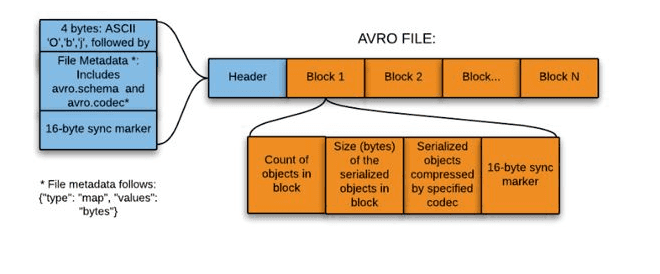

## What is Avro ?
- Apache Avro is a schema-based binary data format used to efficiently store and transfer large amounts of structured data in big-data and streaming systems.

 ##  Why Avro is used in streaming pipelines ?
###  Avro is chosen because it provides:
 - Compact binary encoding

-  Schema evolution support

-  Block-level compression

-  Streaming-friendly writes

## What is a codec? 

### A codec is a compression algorithm used by Avro to compress blocks of records inside an Avro file.

### Common codecs:

- snappy (default for streaming)

- deflate

- bzip2

- zstandard

## Conceptual Guide: Avro in Streaming & Big-Data Systems





## The role of the schema

### The schema defines:

- Field names

- Data types

- Default values

- Compatibility rules

### Key idea:

- Schema is not repeated for every record

- It is written once (or referenced externally)

- This makes Avro extremely efficient for large datasets.


## How Avro stores large data (conceptually)

```scss
Header
 ├─ Schema
 ├─ Metadata
Data Blocks
 ├─ Block 1 (many records)
 ├─ Block 2 (many records)
 ├─ Block 3 (many records)

```
### Each block may contain thousands of records.

## What is a codec (core concept)
### A codec is a compression algorithm applied to each data block.
- Compression is per block, not per record

- Blocks are compressed independently

- Readers automatically decompress blocks


## Why block-level compression matters

### Block compression gives:

- Smaller file size

- Faster disk reads

- Faster network transfer

- Better parallel processing

### This is why Avro works well with:

- Streaming pipelines

- Distributed processing engines


## Common codecs (conceptual)

| Codec         | Purpose                  |
| ------------- | ------------------------ |
| **Snappy**    | Fast streaming pipelines |
| **Deflate**   | Balanced storage         |
| **Bzip2**     | Archival data            |
| **Zstandard** | Modern high-compression  |


## Why Avro fits streaming systems

### Streaming systems require:

- Continuous writes

- No need to know dataset size upfront

- Fast serialization/deserialization

### Avro supports:

- Append-only writes

- Block-by-block flushing

- Streaming-friendly compression


## Schema evolution (why enterprises choose Avro)

### Avro allows:

- Adding new fields

- Removing old fields

- Renaming fields (via aliases)

### Without breaking:

- Old producers

- Old consumers

- Historical data

### This is critical for long-running pipelines.
