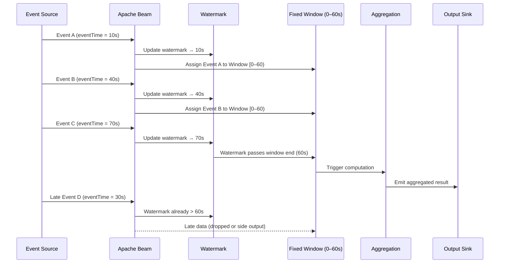
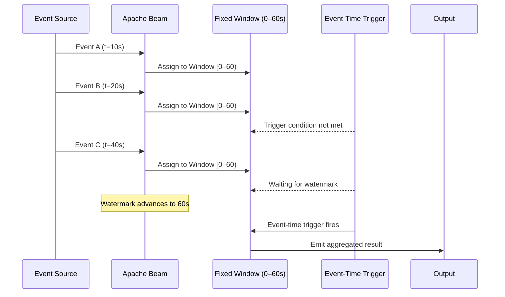
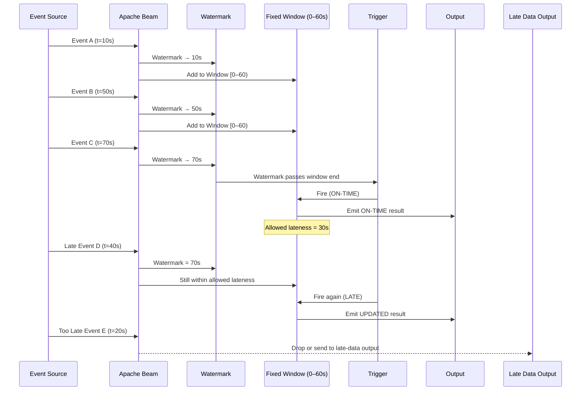

# Internal Working of beam 

### In a DoFn class, we don’t override any interface method,yet when we annotate a method with @ProcessElement,Beam magically treats it as the main processing method ?

 - 👉 Apache Beam uses reflection + annotations to discover lifecycle methods at runtime.
 - @ProcessElement is not magic — it’s metadata.

 ### ✅ Annotation-Based Approach (Beam)
 - Beam allows multiple special methods:
 
 | Annotation        | Purpose                |
| ----------------- | ---------------------- |
| `@Setup`          | Once per DoFn instance |
| `@StartBundle`    | Per bundle             |
| `@ProcessElement` | Per element            |
| `@FinishBundle`   | End of bundle          |
| `@Teardown`       | Cleanup                |

### 🔥 How Beam Executes @ProcessElement
- Beam creates a DoFnInvoker

- It scans the DoFn class

- Finds the method annotated with @ProcessElement

- Validates method signature

- Caches the method reference

- Calls it once per element

### 🧠 How Beam Knows Method Parameters
### Beam inspects parameters using annotations:

| Parameter            | Meaning         |
| -------------------- | --------------- |
| `@Element T`         | Current element |
| `OutputReceiver<T>`  | Output          |
| `ProcessContext`     | Full context    |
| `@Timestamp Instant` | Event time      |
| `@PaneInfo PaneInfo` | Window info     |
| `@SideInput`         | Side input      |

### Beam injects values automatically.
#### ✨ Example: Parameter Injection

```java
@ProcessElement
public void process(
    @Element String line,
    OutputReceiver<String> out,
    ProcessContext ctx,
    @Timestamp Instant ts) {

    out.output(line + " @ " + ts);
}
```
### Beam decides :
- What to pass

- When to pass

- From where to pass

### Windowing & Watermark – Sequence Diagram



## 1️⃣ Window + Trigger Diagram



# ## Key idea

- Window decides where events go

- Trigger decides when results are emitted

## 2️⃣ Late Data with Allowed Lateness Diagram


### Mental Model (Easy to Remember)
- Window → groups data
- Watermark → time progress
- Trigger → when to emit
- Allowed lateness → how long to wait for late events
